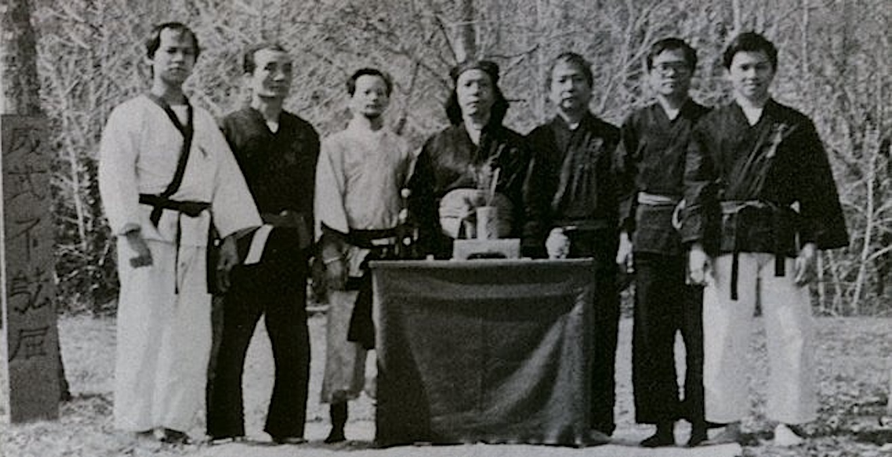
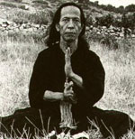
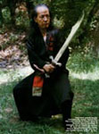

Devant la multitude des arts martiaux asiatiques que nous connaissons
aujourd’hui, nous avons voulu présenter les racines de celui que nous pratiquons
en résumant par l’histoire des arts martiaux vietnamiens (_võ_) qui est
intimement liée à l’histoire du pays lui-même.

## Les arts martiaux vietnamiens en France {#arts-martiaux-vietnamiens-en-france}

### Le _võ_ en France

Au cours des deux guerres mondiales, de nombreux maîtres de _võ_ sont venus en
France en tant que soldats des colonies et certains s’y sont installés. Plus
récemment, les conflits d’Indochine et du Vietnam ont provoqué une diaspora
vietnamienne et, du fait des liens entre la France et le Vietnam, le _võ_ a
commencé à s’implanter dans notre pays. Il est impossible de savoir de quand
date l’introduction des [arts martiaux vietnamiens](#le-vo) car certaines écoles
sont restées secrètes mais, parmi les précurseurs de l’ouverture au public dès
le début des années 50, on compte Nguyễn Đức Mộc (_Sơn long quyền thuật-Võ Việt
Nam_), Hoàng Nam (_Wutao_) et Nguyễn Dân Phú (_Thanh Long_).

### La fédération de Việt _võ_ đạo

[Maître Nguyễn Dân Phú](#maitre-nguyen-dan-phu) est contacté en 1973 par Maître
Phan Hoang qui a le projet de créer un fédération pour regrouper les arts
martiaux vietnamiens indépendamment de la fédération de Judo, seule structure
officielle d’art martiaux à l’époque. Le nom choisi est « Fédération française
de Việt _võ_ đạo » (F.F.V.V.D.), avec l’aval du patriarche du _Vovinam_, maître
Lê Sáng, car le nom « _Việt võ đạo_ » ne se rapporte jusqu’alors qu’au mouvement
fondé au Vietnam par Nguyễn Lộc.

### Maitres fondateurs de la Fédération française de _Việt võ đạo_

{.float-left}

Les maîtres fondateurs de cette première tentative de rassemblement des écoles
de _võ_ sont (dans l’ordre de la photo) Phạm Xuân Tòng, Nguyễn Trung Hòa, Hoàng
Nam, Nguyễn Dân Phú, Bùi Văn Thịnh, Phan Hoàng, Tasteyre Trần Phước et Trần Minh
Long (pas sur la photo). Leur salut est « la main d’acier sur le cœur de bonté
», leur symbole le bambou et leur devise « être fort pour être utile ».

### L’après F.F.V.V.D.

La F.F.V.V.D. reçoit l’agrément ministériel en 1978 et le conserve
jusqu’en 1987. S’ensuit une période de flou sur la situation administrative et
juridique des arts martiaux vietnamiens et une multiplication des fédérations à
tel point que maître Lê Sáng a lancé un appel en 1998 pour que le nom _Việt võ
đạo_ ne soit utilisé que pour désigner le _Vovinam_.

Depuis le début de la saison 2007-2008, le ministère se tourne vers la
[Fédération française de karaté et disciplines associées (F.F.K.D.A.)](https://www.ffkarate.fr/)
pour accueillir et chapeauter les arts martiaux vietnamiens en France. Cette
volonté se concrétise par l’attribution de la
[délégation correspondante](https://www.legifrance.gouv.fr/loda/id/JORFTEXT000020018814)
le 15 décembre 2008.

## Maître Nguyễn Dân Phú {#maitre-nguyen-dan-phu}

{.float-left}

Maître Nguyễn Dân Phú naît en 1911 dans la maison de ses ancêtres à Đa Ngưu, un
village à 30 kilomètres de Hà Nội mais passe toute la première partie de sa vie
dans un environnement aisé à Hà Nội, où sa famille s’est installée depuis
longtemps. Sa mère s’occupe du commerce de luxe du thé au lotus et son père est
ingénieur des mines et de l’industrie.

Un jour que ce dernier reçoit des amis, il appelle le jeune Phú pour lui
présenter Cự Tốn, un maître de _võ_ très renommé et lié à la famille impériale,
qui lui donne immédiatement sa première leçon. C’est le début d’une passion pour
les arts martiaux que son père décide d’encourager. Il demande à ses amis
experts qui lui rendent visite d’enseigner leur art à son fils et fait venir des
maîtres réputés de tout le pays. Nguyễn Dân Phú aborde alors de nombreux styles
du nord du Vietnam en majorité chinois (_Thiếu Lâm_) comme le _La Hán Quyền_ («
boxes des 羅漢 _luóhàn_ [^1] »), le _Mai hoa Quyền_ (« boxe de la fleur de
prunier ») ou le _Liên Hoa Quyển_ (« boxe de la fleur de lotus »). Son dernier
maître, Nguyễn Hoa, a été l’élève de Ba Cát, un des plus célèbres maîtres de la
fin du XIXe siècle au Vietnam. Lui et Cự Tốn, son premier maître, furent
probablement les plus importants à ses yeux car ils personnifièrent les deux
courants principaux des arts martiaux dans le pays, le _Thiếu Lâm_ et le _võ_
traditionnel vietnamien (_Bình Định_ par exemple).

Durant toute cette période, Nguyễn Dân Phú vit une jeunesse dorée partagée entre
l’entraînement et ses amis, avec qui il participera à de nombreux combats entre
pratiquants de _võ_ ou pour défendre l’honneur des jeunes filles de son
quartier. Il acquiert ainsi une réputation d’excellent combattant à Hà Nội.

{.float-right}

En 1940, il s’embarque pour la France en tant qu’interprète pour les contingents
d’ouvriers que le gouvernement français fait venir d’Indochine pour travailler
dans ses usines d’armement. Après la guerre, il s’installe à Montluçon et ouvre
une boutique de photographie. Il n’enseigne les arts martiaux
qu’occasionnellement jusqu’à ce que ses fils manifestent un intérêt pour le
karaté, qui commence à émerger. À la fin des année 50, il crée donc une première
école qu’il nomme _Mai hoa Quyền_, dans laquelle sont abordées essentiellement
les durcissements, les positions et les applications des techniques de combat.
Elle ne compte au départ que quelques élèves en plus des huit fils du maître.

Au fur et à mesure, Nguyễn Dân Phú intègre à son enseignement des _quyền_, des
leçons et l’étude des armes, codifiant et enrichissant ce qu’il a appris dans sa
jeunesse. L’école prend finalement le nom de « _Thanh Long_ », que nous
connaissons aujourd’hui, d’après le surnom du maître : _Đại Việt Thanh Long_ («
l’invincible dragon vert »).

Le style _Thanh Long_ se fait peu à peu connaître et se développe car les fils
du maître ouvrent plusieurs salles dans d’autres villes. Maître Phú participe en
1973 à la création de la première
[fédération d’arts martiaux vietnamiens, la F.F.V.V.D.](#arts-martiaux-vietnamiens-en-france),
qui obtient l’agrément ministériel en 1978 en vue de rassembler et représenter
les arts martiaux vietnamiens. En 1979, il confie la salle de Montluçon à l’un
de ses fils et n’enseigne plus qu’aux ceintures vertes et pendant les stages.
Malgré les problèmes que connaît la F.F.V.V.D., l’école s’agrandit et compte de
plus en plus de salles jusqu’en 1991, date à laquelle elle se scinde en trois
branches dirigées par trois de ses fils : le _Thanh Long Đông Hải_ de Serge, le
_Thanh Long Trường Sơn_ de Gérard et le _Thanh Long Sơn Hải_ de Michel.

Nguyễn Dân Phú est invité par les trois écoles en tant que patriarche du style
_Thanh Long_ et continue d’enseigner aux ceintures vertes. Jusqu’à sa
disparition le 28 juin 1999, il n’aura cessé d’enrichir le style qu’il a créé et
de transmettre sa passion pour les arts martiaux.

Source: André Gazur, _Nguyễn Dân Phú_, sa vie, son œuvre.

[^1]: Saint bouddhiques

## Le _võ_ {#le-vo}

Le terme _võ_ est le plus général pour désigner les arts martiaux vietnamiens.
Il provient de _võ thuật_, lecture sino-vietnamienne de l’expression
chinoise 武術 _wǔshù_ (_bujutsu_ japonais), qui signifie « art de la guerre » ou
plus précisément « art d’arrêter la lance ».

Le Vietnam possède une tradition martiale plusieurs fois millénaire qui s’est
développée et enrichie dans le contexte d’une histoire faite d’invasions, de
résistances et d’échanges du fait de sa situation géographie stratégique, au
croisement de diverses routes commerciales.

L’histoire vietnamienne étant très riche, ce qui suit n’est qu’une modeste
introduction en vue de présenter les étapes importantes dans la formation du võ
tel qu’on le connaît aujourd’hui. Par souci de simplicité, nous avons
exclusivement utilisé le terme « Vietnam » bien que le pays ne se soit appelé
ainsi que depuis le XIXe siècle et qu’il ait porté divers noms tels que _Âu Lạc,
Nam Việt_ ou encore _Đại Cồ Việt_.

### Grandes étapes de l’histoire du Vietnam et de la formation du võ

1. L’Antiquité (2879 à 111 av. J.-C.) ;
2. La domination chinoise (111 av. J.-C. à 938 ap. J.-C.) ;
3. Les grandes dynasties nationales et le développement du _võ_ (939-1862) ;
4. Dynastie des Nguyễn et colonisation française : interdictions de la pratique
   du võ.

De nos jours au Vietnam, ce sont les termes _võ cổ truyền_ ou _võ thuật cổ
truyền_ qui sont utilisés pour désigner le _võ_. La grande majorité des arts
martiaux de toute origine est regroupée dans le _Liên đoàn võ thuật cổ truyền
Việt Nam_, excepté le _Vovinam Việt võ đạo_, qui s’est doté en 2006 d’une
fédération indépendante.

Le _võ_ constitue un des trésors de la culture du Vietnam et s’est forgé dans le
contexte d’une histoire très riche. Il est l’œuvre de tout un peuple, des écoles
familiales aux académies militaires, des styles _Thiếu Lâm_ d’origine chinoise
aux arts martiaux régionaux tels le _võ thuật Bình Định_. Fort heureusement pour
nous, l’arrivée de maîtres en France nous a permis de découvrir la richesse
infinie de cet art.

Sources:

- Histoire du Vietnam (liens morts) ;
- site de l’école [Bát Môn Quyền](https://batmonquyen.blogspot.com/) ;
- [héros du Vietnam](https://www.vietnammonpaysnatal.fr/).

### L’Antiquité (2879 à 111 av. J.-C.)

La découverte de peintures murales dans des grottes du Nord-Vietnam, d’objets
décorés de scènes guerrières et d’armes (sabres, haches, arcs, etc) témoignent
de l’existence de techniques martiales dès la période qui s’étend de 2879 à 111
av. J.-C.

Cette époque est appelée « semi-légendaire » car elle regroupe diverses mythes
fondateurs de l’identité vietnamienne, tels la naissances des cent fils du roi
dragon Lạc Long et de l’immortelle Âu Cơ à l’origine du peuple Việt, ou
l’épisode de la prise de la citadelle en spirale de Cổ Loa (ou Loa Thành),
réputée inexpugnable, à laquelle se réfère le _Loa thành quyền_ de notre école.

### La domination chinoise (111 av. J.-C. à 938 ap. J.-C.)

La période de près d’un millénaire qui suit est marquée par la domination de la
Chine sur le Vietnam, malgré quelques soulèvements, comme celui des sœurs Trưng
et l’existence de quelques dynasties opposées à l’envahisseur, telles les Lý ou
les Triệu.

Les Chinois vont s’implanter profondément dans le pays et en modeler les
structures sociales, administratives et militaires ainsi qu’en influencer
fortement la culture. Les philosophies taoïste, confucianiste et bouddhiste,
notamment la doctrine 禪 _chán_ du moine Bodhidharma, s’intègrent à la vie des
Vietnamiens et les arts martiaux chinois donnent naissance aux premières écoles
_Thiếu Lâm_ (vietnamien pour 少林 Shàolín). Ce terme désigne aujourd’hui les
écoles d’ascendance chinoise, qu’elles aient ou pas un rapport avec Shàolín.
Tout au long de l’histoire, des maîtres chinois s’installeront au Vietnam et des
maîtres vietnamiens iront étudier en Chine, nourrissant le _Thiếu Lâm_, qui est
un des courants les plus important du _võ_.

C’est également à cette époque que se forment les principes de base du _võ_ :

- supériorité des techniques rapprochées : _dĩ đoản thắng trường_ ;
- la souplesse contre la force : _dĩ nhu chế cương_ ;
- principe des surprises : _kỷ tập chiến pháp_ ;
- le secret des illusions : _ảo ảnh bí pháp_ ;
- esquives sans résistance : _phản gựt pháp_.

Ce sont ces principes qui permirent aux soldats vietnamiens de résister à des
ennemis plus nombreux, mieux armés et souvent plus grands et de remporter des
victoires décisives contre les Chinois et les forces mongoles des successeurs de
Gengis Khan.

### Les grandes dynasties nationales et le développement du _võ_ (939-1802)

La domination chinoise prend fin en 939 par la bataille du Bạch Đằng. Ngô Quyền
chasse les Chinois et fonde la première dynastie nationale. C’est une période de
relative unité, marquée par une volonté d’expansion et une organisation de plus
en plus complexe de la société et de l’armée.

En ces temps de stabilité, le _võ_ se développe sous l’impulsion de rois maîtres
en arts martiaux et, s’enrichissant des philosophies taoïste, bouddhiste et
confucianistes, devient un art de vie visant à l’élévation spirituelle.

De grandes étapes marquent ce développement et la profonde intégration des arts
martiaux à la culture vietnamienne.

Quelques décennies après l’indépendance, le fondateur de la dynastie des Đinh,
Đinh Tiên Hoàng, organise l’armée de manière moderne en instaurant un corps très
important de réservistes, système qui subsistera jusqu’au XIXe siècle. En effet,
l’armée effectivement en service compte environ 120 000 hommes mais le nombre de
soldats inscrits sur les registres est d’environ un million. Les réservistes
exercent par ailleurs un autre métier ; ils sont par exemple cultivateurs ou
artisans et le _võ_ est ainsi présent dans tous les villages. Cette organisation
causera bien des problèmes aux divers envahisseurs qui rencontreront une
résistance inattendue de ces soldats-paysans.

Au sommet de l’état vietnamien, l’art martial prend une importance inédite. Sous
la dynasties des Lý (1010-1225), tous les officiels, mandarins et
fonctionnaires, ainsi que les hommes et les dames de la cour se doivent de
pratiquer le võ. La dynastie Trần (1225-1400) instaure les _giảng võ đường_ («
académies d’arts martiaux »), qui délivrent les grades de licenciés et docteurs
en arts martiaux nécessaires pour accéder aux fonctions militaires élevées. Le
général Trần Hưng Đạo, devenu célèbre par sa victoire sur les Mongols, est
l’auteur de traités fondamentaux sur l’art martial vietnamien.

S’ensuit une époque de troubles avec une nouvelle domination des Chinois de la
dynastie 明 Míng, qui se sont insinués dans les affaires nationales avant de
prendre le contrôle du pays. De nombreux maîtres de _võ_ sont assassinés et de
nombreux ouvrages détruits. Après une lutte de dix ans, Lê Lợi, considéré depuis
lors comme un héros national, les chasse du Vietnam à partir de Lam Sơn et fonde
en 1428 une dynastie à l’origine d’une organisation militaire, administrative et
judiciaire très poussée (code des Lê) et d’une montée en puissance des lettrés
dans la société. Un exemple de cette organisation est l’existence dans l’armée
d’un système de cinq tours de service dans lequel les soldats alternaient entre
leurs devoirs militaires et leurs occupations professionnelles, ce qui
permettait d’avoir des troupes toujours entraînées et mobilisables rapidement.
Un école de võ, créée en 1945 sous le joug colonial français, porte le nom de
_Lam Sơn võ đạo_, en l’honneur de Lê Lợi et de son action de résistance.

Dès la fin du XVIe siècle et jusqu’à la fin du XVIIIe, le pays est divisé en
deux par une rivalité entre le clan Trịnh au nord et Nguyễn au sud. Cette guerre
civile met le Vietnam à feu et à sang et trois frères originaires de la région
de Tây Sơn (de la province de Bình Định), Nguyễn Huệ, Nguyễn Nhạc et Nguyễn Lữ,
décident de mener une insurrection, appelée par la suite la révolte des Tây Sơn,
pour restaurer l’unité nationale. Ils reprennent peu à peu le contrôle de tout
le territoire et Nguyễn Huệ devient l’empereur Quang Trung en 1788 après avoir
défait les troupes chinoises des 清 Qīng venue prêter main forte au dernier
souverain Lê.

Quang Trung, lui aussi un des grands héros du Vietnam, rendit célèbre un des
grands courants du võ, le _Bình Định_, nommé d’après sa région d’origine. C’est
en effet à partir de cette famille d’arts martiaux qu’il élabora l’art martial
officiel enseigné dans les académies militaires. Le programme et le déroulement
des concours qu’il instaura se trouve décrit très en détail dans plusieurs
ouvrages d’époques et des thèses contemporaines écrites sur le sujet. On y
apprend notamment que le candidat doit passer de nombreuses épreuves en un seul
jour : démonstration du maniement des dix-huit armes traditionnelles, cinq
combats à mains nues, cinq avec une arme imposée et cinq avec une arme choisie
contre des gardes royaux, épreuves théoriques sur un sujet portant sur la
stratégie militaire, les armes ou encore les grands généraux du passé. Ces
concours étaient d’un niveau élevé car, par exemple, l’exécution manquée d’une
seule des armes était éliminatoire et le candidat devait remporter au moins
trois combats par catégorie contre des soldats qui risquaient une suppression
temporaire de solde s’ils étaient vaincus.

De cette époque datent des _quyền_ traditionnels qui sont encore transmis de nos
jours, tels le _Lão mai quyền_ (« quyền du vieux prunier ») et il existe
plusieurs écoles dont le nom contient les termes « Tây Sơn » ou « Bình Định » en
souvenir de cet héritage.

### Dynastie des Nguyễn et colonisation française : interdictions de la pratique (1802-1945)

Après la mort prématurée de Quang Trung en 1792, ses frères, rois du sud et du
centre du Vietnam, prennent sa suite mais le descendant des seigneurs Nguyễn,
Nguyễn Ánh, les dépossède du pouvoir en 1802 avec l’aide des Français et se
proclame empereur sous le nom de Gia Long.

Dans la région de Bình Định sont promulguées des lois interdisant la pratique
des arts martiaux et dans tout le pays le _võ_, confronté aux armes modernes,
tombe peu à peu en désuétude. Ce phénomène est renforcé par le mode de vie de la
société industrialisée apporté par les Français, qui s’immiscent de plus en plus
dans les affaires nationales jusqu’à transformer la Cochinchine (province du
sud) en colonie et le Tonkin (nord) et l’Annam (centre) en protectorats, mettant
fin à l’indépendance du Vietnam. Le _võ_ est alors frappé d’interdiction totale
pour éviter toute insurrection mais beaucoup d’écoles continuent à enseigner en
secret, participant ainsi à la résistance au colonialisme.

Vers les années 1940-1950 et la fin de la domination française, apparaissent des
grands mouvements de rassemblement des écoles de võ dans toutes les provinces,
tels que le _Võ phái Bắc Hà_, le _Võ Bình Định_, le _Tinh võ hội_ ou le _Võ phái
Nam Bộ_. Le _Vovinam Việt võ đạo_ de Nguyễn Lộc se différencie quelque peu de
ces structures car c’est au départ une école avant de devenir un mouvement
destiné à regrouper tous les arts martiaux sous une même bannière dans un but de
modernisation et un aspect plus sportif.
