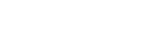

L’école **Chấn Điện Võ Đường** (association _Montpellier Viet Vo Dao_) a été
fondée en 2003 par [Adda Keliche](#le-fondateur) dans le but d’enseigner et de
promouvoir un art martial vietnamien issu du style _Thanh Long_.

C’est une véritable **école traditionnelle** dans laquelle chacun, sans
distinction, peut suivre une formation complète qui aborde tous les aspects de
l’art martial.

L’art y est enseigné dans une optique d’**épanouissement de l’individu** et sans
aucune visée compétitive. Chacun vient chercher ce qui lui convient — méthode de
défense, pratique de santé — et s’implique comme il l’entend, loisir pour
certains, art de vivre et voie à suivre pour d’autres.

L’école est **ouverte à tous à partir de 5 ans**.

Depuis septembre 2008, l’école Chấn Điện Võ Đường est affiliée à la
<abbr title="Fédération française de karaté et disciplines associées">F.F.K.D.A.</abbr>.
Elle est agréée par le ministère de la Jeunesse et des sports sous le numéro
S-12-2010 en date du 14 mai 2010.

## Le fondateur {#le-fondateur}

{.float-right}

**Adda Keliche** est un expert en arts martiaux vietnamiens, reconnu Maître 6ᵉ
Dang (Dan), fondateur de Chấn Điện Võ Đường – l’une des rares écoles
traditionnelles qui transmet encore cet art selon les valeurs humaines issues
des grandes philosophies asiatiques.

Son enseignement repose sur une **approche complète et respectueuse des
traditions**, en lien avec l’éthique, la transmission et l’évolution
personnelle.

Adda maîtrise aussi bien la **partie martiale**, dans une recherche de
discipline intérieure et de dépassement de ses propres peurs, que les
**pratiques liées à la santé et au bien-être** : Chi Kong, Tai Chi, méditation,
respiration, circulation de l’énergie vitale.

{.float-left}

Il enseigne également le maniement des **armes traditionnelles**, et intègre à
sa pédagogie des savoirs issus des lois universelles, de la médecine
traditionnelle chinoise, ainsi que des techniques de massage, considérés comme
des éléments à part entière de la pratique martiale.

Parallèlement, Adda Keliche dirige [Espace Vital](https://espacevital.fr), un
organisme de formation spécialisé dans la gestion du stress, des conflits et des
agressions, où il met à profit son expérience martiale au service de la
prévention des risques psychosociaux (RPS). Formateur référencé par la CARSAT,
il intervient dans de nombreuses structures en accompagnant les professionnels
vers plus de maîtrise, de sécurité et d’équilibre au travail. Son double
parcours – dans la voie martiale traditionnelle et la formation en entreprise –
en fait une figure singulière et engagée, au carrefour de la transmission, du
soin et de la transformation intérieure.

## Les grades {#les-grades}

Le système de **grades** dans notre école comprend **six étapes de
progression**.

Le _võ sinh_ (pratiquant de võ, l’art martial) débute avec une **ceinture
blanche** à laquelle on ajoute des **barrettes** — ou _cấp_ — vertes jusqu’au
nombre de quatre ; il appartient alors au _premier cercle_.

L’étape suivante et dernier grade de l’école est la **ceinture verte** ; elle
marque l’entrée dans le _deuxième cercle_, celui des disciples.

L’élève fait officiellement partie de l’école à partir de la première barrette,
qui symbolise son travail et sa volonté d’apprentissage. Les barrettes
correspondent en général à un an ou deux de pratique assidue dans le respect des
valeurs de l’art martial. Le délai entre la quatrième barrette et la ceinture
verte est plus long car le _võ sinh_ doit avoir formé son corps et assimilé le
travail du premier cercle avant de pouvoir accéder à l’enseignement supérieur du
deuxième cercle.

## Le nom et le symbole de notre école {#nom-et-symbole}

**_Chấn Điện Võ Đường_** est le nom en vietnamien [^1] de notre école.

{.float-right}

On peut traduire l’expression _chấn điện võ đường_ par "**école d’art martial
éclair-tonnerre**" : ─ _võ đường_ signifie "école (_đường_) [d’art] martial
(_võ_)" ; ─ _chấn điện_ est une expression chinoise qu’on peut traduire mot à
mot par "éclair (_điện_) [et] tonnerre (_chấn_)". C’est cette expression qui
désigne réellement le nom de l’art pratiqué dans notre école.

Le nom de l’école s’écrit aussi en caractère chinois [^2] : 震電武堂 (_zhèndiàn
wǔtáng_). Si votre navigateur ne permet pas d’afficher le chinois, en voici une
version en image :

L’expression 震電 zhèndiàn (_chấn điện_) signifie proprement "**tonner et
briller d’éclairs**" ; elle se compose de deux caractères riches de sens
symboliques. Ainsi, le premier peut aussi signifier "un violent coup de tonnerre
ébranlant la terre", "ébranler", "vibration", "foudroyer", "frapper avec la
rapidité de la foudre" mais aussi "majesté [^3]", "qui en impose" et "inspirer
la terreur". Quant au second, s’il a comme sens primordiaux "éclair" et
"électricité", il se traduit aussi par « brillant » ou encore « rapide ».

[^1]:
    Pour être plus précis, il est en sino-vietnamien : c’est une variante de
    cette langue datant de l’époque où [la Chine dominait le Vietnam](TODO) dans
    laquelle les mots sont en fait du chinois prononcé en vietnamien.
    L’empreinte culturelle du chinois fait qu’encore aujourd’hui de nombreuses
    expressions et termes, dans les domaines de la culture et des sciences, sont
    d’origine chinoise. Notre art martial étant sino-vietnamien, il est normal
    que son nom le soit aussi.

[^2]:
    Même si les Vietnamiens n’écrivent plus actuellement leur langue en
    caractères chinois, il l’ont fait pendant des siècles. Du reste, le
    sino-vietnamien s’est longtemps écrit en caractères chinois.

[^3]: Au sens de "grandeur" et non d’"altesse"

### Symbole

Le symbole est composé de plusieurs éléments qui évoquent les aspects les plus
importants de notre pratique, répartis en huit directions (ou 八卦 _bāguà_ en
chinois, _bát quái_ en sino-vietnamien ; c’est le même terme qui désigne l’art
martial nommé _bát quái chưởng_). Les couleurs, les caractères chinois et leur
emplacement dans le symbole sont signifiants.

Les huit caractères chinois, si on les lit de haut en bas et dans le sens
inverse des aiguilles d'une montre, signifient :

{.float-left}

1. **_võ_**: "art martial"
2. _lễ_: "politesse"
3. **_chấn_**: "tonnerre"
4. _chí_: "volonté"
5. **_điện_**: "éclair"
6. _tín_: "confiance"
7. **_đường_**: "école"
8. _nghĩa_, "équité"

<small><strong>Note</strong>: les traductions données ici sont littérales et ne
permettent pas d'appréhender les sens multiples et profonds de chaque caractère,
qui possède sa symbolique propre.</small>{.clear}

Le nom de l’école est ainsi mêlé à quatre autres termes, qui sont les valeurs de
l’école. On remarque que le nom de l’école dessine lui-même un éclair à travers
le symbole.
