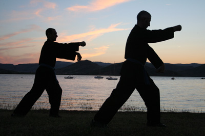

Nous pratiquons dans l’école _Chấn Điện Võ Đường_ un art martial descendant du
style **_Thanh Long_** tel que notre enseignant,
[Adda Keliche](/notre-ecole/#le-fondateur), l’a appris auprès d’un disciple du
maître _Nguyễn Dân Phú_. Ce dernier a créé ce style à partir de son savoir dans
les arts martiaux vietnamiens des courants _Bình Định_ et _Thiếu Lâm_. Il en a
codifié les principes et les mouvements de base et l’a enrichi jusqu’à son décès
en 1999.

> « Je pratique cet art depuis l’âge de 17 ans, soit plus de 35 années de
> dévouement et d’expérience. Cette longue pratique m’a permis d’approfondir ma
> compréhension des techniques physiques et des principes énergétiques qui
> fondent notre discipline.
>
> L’enseignement que je transmets aujourd'hui est le fruit de plusieurs
> décennies de recherche, de transmission et d'engagement, où l'art martial
> devient bien plus qu’un simple combat. C’est un véritable chemin de vie, un
> moyen d’éveil, de transformation et de croissance personnelle, intégrant des
> dimensions physiques, spirituelles et philosophiques. »
>
> — [Adda Keliche](/notre-ecole/#le-fondateur)

## L'enseignement {#enseignement}

Bien qu’il soit un tout indivisible, notre enseignement est structuré en trois
composantes que sont l’[interne](#interne), l’[externe](#externe) et les
[armes traditionnelles](#armes-traditionnelles). Cette séparation a pour but
d’offrir des repères à ceux qui désirent se lancer dans cette voie mais **ces
trois facettes forment un tout cohérent**.

La distinction interne-externe que nous faisons ici est quelque peu différente
de celle qui se fait d’habitude entre arts martiaux externes tels que le 少林拳
_Shàolín quán_, le 洪家 _hung gar_, etc., et les arts martiaux internes comme
le 太極拳 _tàijí quán_ ("tai chi chuan") ou le 八卦掌 _bāguà zhǎng_. Ces deux
courants possèdent en effet des aspects internes et externes au sens où nous
l’entendons.

Nous pratiquons vêtus du _võ phục_ (vêtement semblable à un kimono) noir, fermé
par une ceinture blanche (avec d’éventuelles barrettes) ou verte pour les
pratiquants plus avancés (voir
[la section sur les grades](/notre-ecole/#les-grades)).

<small>**Note** : dans notre site, les photographies nous montrent parfois en
tenue plus légère car celles-ci sont souvent prises au cours du stage d’été où,
après les saluts traditionnels, nous sommes autorisés à enlever la
veste.</small>

### Interne {#interne}

{.float-right}

Dans notre école, nous appelons "**interne**" le travail qui va **vers
l’intérieur du corps**, dans lequel on cherche à comprendre et maîtriser les
mécanismes physiques internes. C’est une pratique de santé et de bien-être,
autant qu’un support pour l’[externe](#externe), versant de notre pratique dans
lequel sont étudiées les techniques qui ont la dynamique inverse, de l’intérieur
vers l’extérieur.

Derrière cette définition volontairement simpliste se cache un domaine très
riche que nous abordons selon plusieurs axes :

- le 氣功 **_qìgōng_** ou _travail de l’énergie_ : travail respiratoire,
  dix-huit séries de mouvements statiques, les cinq animaux ;
- la **méditation** ;
- le **_bát quái chưởng_** (八卦掌 _bāguà zhǎng_).

{.float-left}

Notons que la notion d’_énergie_ est un des fondements de la médecine
traditionnelle chinoise et ne représente rien d’abstrait ou de mystique mais
bien un ensemble de phénomènes qui s’appréhendent physiquement en premier lieu.

À l’instar du _yin_ et du _yang_ dans le 道 _Dào_ ("Tao"), l’interne et
l’externe sont deux faces de l’art martial qui se nourrissent l’une de l’autre
et se rejoignent à un niveau avancé. De fait, nous n’envisageons pas l’une sans
l’autre. En effet, la pratique de l’interne seule qualifie la santé mais
l’aptitude à se défendre fait défaut. De même la pratique martiale seule peut
nuire au corps s’il est sollicité sans ménagement et l’apport d’énergie yang
uniquement peut provoquer agressivité et manque de contrôle.

### Externe {#externe}

{.float-left}

L’**externe** représente l’aspect le plus répandu de l’art martial en Occident
et vise à la maîtrise du combat par le travail des techniques des mains, de
pieds, d’enchaînements codifiés ou d’applications à deux.

Nous le pratiquons sans aucune motivation compétitive, la compétition déformant
par ses règles l’expression de l’art martial. Le but de l’étude martiale dite
"externe" est d’**apprendre à se défendre** et à **défendre les autres** en
**maîtrisant son corps et ses peurs**.

Il existe d’**innombrables méthodes de combat**, chacune avec ses
particularités, certaines se concentrant sur le travail des bras, d’autres
spécialisées dans les coups de pieds, des boxes à longue ou courte distance, des
systèmes privilégiant l’utilisation de la main ouverte ou encore des coudes et
des genoux. De très nombreuses écoles, comme la nôtre, utilisent toutes les
armes naturelles du corps (pieds, mains, coudes, genoux...).

{.float-right}

Cependant, il serait simpliste de penser qu’un style martial est meilleur qu’un
autre à cause du nombre de techniques enseignées. À un haut niveau de maîtrise,
l’artiste martial dépasse le côté technique et peut appliquer librement les
principes qu’il a travaillés. La plupart du temps, il n’y a pas de bons ou de
mauvais styles, seulement des bons ou des mauvais pratiquants.

L’étude de l’externe dans notre école comprend de nombreuses facettes :

- les **bases** ;
- Les **formes de la main** ;
- les 八卦 **_bāguà_** ("pa kua") ;
- Les **_quyền_** ;
- les **applications à deux** ;
- les **combats**.

### Armes {#armes}

{.float-right}

L’apprentissage des **armes traditionnelles** — telles que le bâton long, le
sabre, l’épée et bien d’autres — complète l’interne et l’externe en forgeant le
corps par un travail spécifique.

L’apprentissage des armes traditionnelles — telles que le bâton long, le sabre,
l’épée et bien d’autres — s’inscrit dans la continuité de l’[interne](#interne)
et de l’[externe](#externe). Bien que cet enseignement puisse paraître obsolète
et inutile de nos jours, son intérêt est au contraire multiple.

Il s’agit en premier lieu de **conserver l’héritage des traditions séculaires**
et des **techniques éprouvées sur le champ de bataille** qui ont abouti aux
formes et enchaînements que nous connaissons aujourd’hui. Les arts martiaux
asiatiques comportent une multitude d’armes issues du corps militaire ou de
toutes les composantes de la société civile (paysans, moines, artisans, etc),
qui sont classées différemment selon les époques, les pays, les écoles. En Chine
et au Vietnam à une certaine époque, l’ordre confucianiste réservait l’épée aux
officiers, la hallebarde aux généraux de cavalerie ou encore le sabre aux
soldats. Plus tard, les concours militaires impériaux du Vietnam imposent aux
candidats au titre de docteur en arts martiaux de connaître les dix-huit armes
traditionnelles du _Bình Định_.

Outre cet aspect traditionnel, l’étude des armes représente une réelle
**richesse dans la pratique actuelle** des arts martiaux. Elle complète
l’éventail technique du pratiquant en abordant des principes nouveaux et
**chaque arme**, du fait de sa forme, sa taille et son utilisation, **développe
des qualités et un travail énergétique qui lui sont propres**.

Les armes suivantes sont étudiées :

  <figure><figcaption>Bâton long</figcaption></figure>
  <figure><figcaption>Bâton court</figcaption></figure>
  <figure><figcaption>Épée</figcaption></figure>
  <figure><figcaption>Sabre</figcaption></figure>
  <figure><figcaption>Fléau</figcaption></figure>

  <figure><figcaption>Armes doubles</figcaption></figure>
  <figure><figcaption>Đại đao</figcaption></figure>
  <figure><figcaption>Lance</figcaption></figure>
  <figure><figcaption>Tri-bâton</figcaption></figure>
  <figure><figcaption>Song đao</figcaption></figure>

### Culture, philosophie et médecine {#culture-philosophie-medecine}

{.float-left}

À cette richesse technique s’ajoute une **richesse culturelle et morale**. En
effet, notre enseignement est imprégné des philosophies chinoises sous-jacentes
aux arts martiaux. C’est pour cela que nous étudions, par exemple, les théories
taoïstes du yin/yang et des cinq éléments ou que sont mises en avant des valeurs
confucianistes telles **le respect** ou **la politesse**.

Les pratiquants sont également initiés aux **bases de la médecine traditionnelle
chinoise**, indispensables au travail de l’interne, au travers de **massages**
et de **notions théoriques sur les méridiens d’acupuncture**.

## Les stages {#stages}

Notre école organise **plusieurs stages pendant l’année**. Certains sont
consacrés à l’art martial tel que nous le pratiquons habituellement et sont
réservés aux _võ sinh_ (pratiquants d’arts martiaux) de l’école.

**Début juillet** nous nous retrouvons pour un **stage d’été de six jours**
pendant lequel nous pratiquons notre art de manière intensive. Ces stages
peuvent être ouverts aux grands débutants, sur demande auprès de l’enseignant.

Pour connaître les dates des prochains stages, consultez-en
[le calendrier](/informations-pratiques/#stages).

### Stages Chấn Điện (week-ends)

Plusieurs fois dans l’année, les _võ sinh_ de l’école se retrouvent pour un
**week-end de pratique intensive**.

{.float-right}

Ces stages servent à aborder les **trois branches de notre art** de manière
différente et plus poussée qu’en cours. Ils sont le lieu principal de
l’apprentissage de nouvelles leçons, de nouveaux _quyềns_, etc., et un moment
d’**approfondissement des connaissances acquises**.

Ces week-ends sont également des occasions privilégiées pour les élèves de
l’école de **se rencontrer hors du cadre habituel des cours** de semaine et de
**renforcer les liens entre frères et sœurs d’arme** en partageant tant l’effort
que les moments de pause.

**Programme** :

- samedi 15h-19h : externe
- dimanche 9h-12h : interne
- dimanche 14h-18h : armes

### Stage d’été

{.float-right}

Le stage d’été constitue le **point d’orgue de l’année de pratique**. Cette
**semaine de pratique intensive** — environ dix heures par jour — permet aux
participants de vivre une **immersion complète dans l’art martial** dans une
ambiance fraternelle et dans le cadre naturel magnifique du lac du Salagou.

On dit généralement que **ce stage équivaut à plusieurs mois de pratique**. Une
expérience inoubliable à tous les niveaux !

L’**entraînement du matin** est consacré à l’[interne](#interne) — méditation,
pratiques énergétiques selon le thème du stage, forme des animaux — et aux
[armes](#armes-traditionnelles). L’**entraînement du soir** est, quant à lui,
orienté vers le travail [externe](#externe) : _quyền_ de positions et _quyền_
fédéraux.

### Journée de fin d’année

À la fin de la saison et juste avant le stage d’été, les _võ sinh_ de l’école
participent à une **journée de pratique** qui constitue une sorte de **bilan de
l’année écoulée**.

La **première partie** de cette rencontre est consacrée à la **présentation du
travail personnel** de chacun et à un tour d’horizon des **connaissances
acquises pendant l’année**.

La **seconde partie** de la journée est dédiée à l’**étude du combat**. Le
travail commence par des exercices simples et évolue progressivement jusqu’au
**combat libre**, dans le respect de l’intégrité physique des partenaires.
